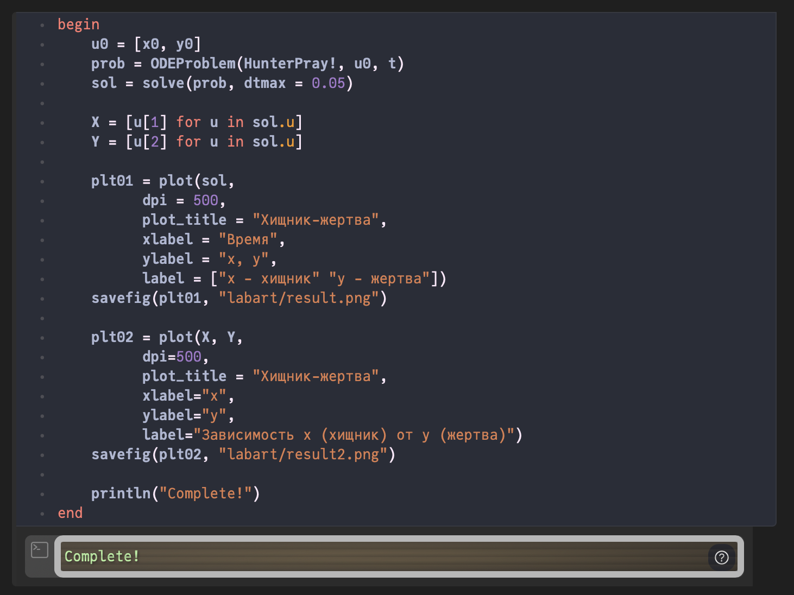

---
## Front matter
title: "Лабораторная работа №5"
subtitle: "Модель хищник-жертва"
author: "Кузнецов Юрий Владимирович"

## Generic otions
lang: ru-RU
toc-title: "Содержание"

## Bibliography
bibliography: bib/cite.bib
csl: pandoc/csl/gost-r-7-0-5-2008-numeric.csl

## Pdf output format
toc: true # Table of contents
toc-depth: 2
lof: true # List of figures
lot: false # List of tables
fontsize: 12pt
linestretch: 1.5
papersize: a4
documentclass: scrreprt
## I18n polyglossia
polyglossia-lang:
  name: russian
polyglossia-otherlangs:
  name: english
## I18n babel
babel-lang: russian
babel-otherlangs: english
## Fonts
mainfont: PT Serif
romanfont: PT Serif
sansfont: PT Sans
monofont: PT Mono
mainfontoptions: Ligatures=TeX
romanfontoptions: Ligatures=TeX
sansfontoptions: Ligatures=TeX,Scale=MatchLowercase
monofontoptions: Scale=MatchLowercase,Scale=0.9
## Biblatex
biblatex: true
biblio-style: "gost-numeric"
biblatexoptions:
  - parentracker=true
  - backend=biber
  - hyperref=auto
  - language=auto
  - autolang=other*
  - citestyle=gost-numeric
## Pandoc-crossref LaTeX customization
figureTitle: "Рис."
tableTitle: "Таблица"
listingTitle: "Листинг"
lofTitle: "Список иллюстраций"
lotTitle: "Список таблиц"
lolTitle: "Листинги"
## Misc options
indent: true
header-includes:
  - \usepackage{indentfirst}
  - \usepackage{float} # keep figures where there are in the text
  - \floatplacement{figure}{H} # keep figures where there are in the text
---

# Цель работы

Рассмотреть модель хищник-жертва. Построить модель средствами OpenModellica и Julia.

# Задачи

Для модели «хищник-жертва»:

$$
\begin{cases}
\frac{dx}{dt} = -0.81x(t) + 0.048x(t)y(t) \\
\frac{dy}{dt} = 0.76y(t) - 0.038x(t)y(t) \\
\end{cases}
$$

1. Построить график зависимости численности хищников от численности жертв, а также графики изменения численности хищников и численности жертв при следующих начальных условиях: $x_0 = 7$, $y_0 = 29$.

2. Найти стационарное состояние системы.

# Среда

-   Julia – это открытый свободный высокопроизводительный динамический язык высокого уровня, созданный специально для технических (математических) вычислений. Его синтаксис близок к синтаксису других сред технических вычислений, таких как Matlab и Octave. 

-   OpenModelica — свободное открытое программное обеспечение для моделирования, симуляции, оптимизации и анализа сложных динамических систем. Основано на языке Modelica. 

# Теоретическое введение

Простейшая модель взаимодействия двух видов типа «хищник — жертва» - модель Лотки-Вольтерры. Данная двувидовая модель основывается на следующих предположениях:

1. Численность популяции жертв x и хищников y зависят только от времени (модель не учитывает пространственное распределение популяции на
   занимаемой территории);
2. В отсутствии взаимодействия численность видов изменяется по модели Мальтуса, при этом число жертв увеличивается, а число хищников падает;
3. Естественная смертность жертвы и естественная рождаемость хищника считаются несущественными;
4. Эффект насыщения численности обеих популяций не учитывается;
5. Скорость роста численности жертв уменьшается пропорционально численности хищников;

$$
\begin{cases}
\frac{dx}{dt} = ax(t) - bx(t)y(t) \\
\frac{dy}{dt} = -cy(t) + dx(t)y(t) \\
\end{cases}
$$

В этой модели $x$ – число жертв, $y$ - число хищников. Коэффициент $a$ описывает скорость естественного прироста числа жертв в отсутствие хищников, $с$ - естественное вымирание хищников, лишенных пищи в виде жертв. Вероятность взаимодействия жертвы и хищника считается пропорциональной как количеству жертв, так и числу самих хищников ($xy$). Каждый акт взаимодействия уменьшает
популяцию жертв, но способствует увеличению популяции хищников (члены $-bxy$ и $dxy$ в правой части уравнения).

Стационарное состояние данной системы (положение равновесия, не зависящее от времени решение) будет в точке:

$$
x_0 = \frac{c}{d},\ y_0 = \frac{a}{b}
$$

Если начальные значения задать в стационарном состоянии

$$
x(0) = x_0,\ y(0) = y_0
$$

то в любой момент времени численность популяций изменяться не будет. При малом отклонении от положения равновесия численности как хищника, так и жертвы с течением времени не возвращаются к равновесным значениям, а совершают периодические колебания вокруг стационарной точки. Амплитуда колебаний и их период определяется начальными значениями численностей $x(0)$, y(0). Колебания совершаются в противофазе.

# Ход работы

Начнем выполнения поставленных задач в Julia. Для этого запустим Pluto. 


Первым делом подкючим пакеты Plots и DifferentialEquations. Далее объявим начальные данные при помощи констант. Также объявим начальное условие для системы ДУ и промежуток времени, на котором будет проходить моделирование. После этого объявим функцию, представляющую систему. (рис. @fig:002)

```

using Plots
using DifferentialEquations

const a = 0.810
const b = 0.048
const c = 0.760
const d = 0.038
const x0 = 7
const y0 = 29

const t = (0, 50) 

function HunterPray!(du, u, p, t)
	du[1] = -a * u[1] + b * u[1] * u[2]
	du[2] = c * u[2] - d * u[1] * u[2]
end
```


В следующей ячейке Pluto построим график зависимости $x$ от $y$ и графики функций $x(t)$, $y(t)$. При помощи DifferentialEquations зададим и решим систему ДУ, после чего построим графики функций $x(t)$, $y(t)$. 
Так же создадим два списка, в которых будут храниться точки уравнений. . Запустим итоговый код. 

```
u0 = [x0, y0]  # начальные условия
prob = ODEProblem(HunterPray!, u0, t)
sol = solve(prob, dtmax=0.05)

X = [u[1] for u in sol.u]
Y = [u[2] for u in sol.u]

plt01 = plot(sol,
      dpi=500,
      plot_title = "Хищник-жертва",
      xlabel="Время (s)",
      ylabel="x, y",
      label=["x - хищник" "y - жертва"])
savefig(plt01, "labart/result.png")

plt02 = plot(X, Y,
      dpi=500,
      plot_title = "Хищник-жертва",
      xlabel="x",
      ylabel="y",
      label="Зависимость x (хищник) от y (жертва)")
savefig(plt02, "labart/result2.png")

println("Complete!")
```




Изменим начальные значения в коде, при которых будет достигаться положение равновесия (не зависящее от времени решение). 

```
u0 = [c/d, a/b] 
prob = ODEProblem(HunterPray!, u0, t)
sol = solve(prob, dtmax=0.05)

X = [u[1] for u in sol.u]
Y = [u[2] for u in sol.u]

plt01 = plot(sol,
      dpi = 500,
      plot_title = "Хищник-жертва",
      xlabel = "Время",
      ylabel = "x, y",
      label = ["x - хищники" "y - жертва"])
savefig(plt01, "labart/result_1_1.png")

plt02 = scatter(X, Y,
      dpi=500,
      plot_title = "Хищник-жертва",
      xlabel="x",
      ylabel="y",
      label="Зависимость x (хищники) от y (жертва)")
savefig(plt02, "labart/result_1_2.png")

println("Success!")
```


Построим график зависимости численности на Modelica. 

```
model Var1
  constant Real a = 0.810;
  constant Real b = 0.048;
  constant Real c = 0.760;
  constant Real d = 0.038;
  Real t = time;
  Real x(t);
  Real y(t);
initial equation
  x = 7;
  y = 29;
equation
  der(x) = -a * x + b * x * y;
  der(y) = c * y - d * x * y;
  annotation(experiment(StartTime = 0, StopTime = 50, Interval = 0.05));
end Var1;
```


Построим график зависимости в стационарном состоянии на Modelica. 

```
model Var2
  constant Real a = 0.810;
  constant Real b = 0.048;
  constant Real c = 0.760;
  constant Real d = 0.038;
  Real t = time;
  Real x(t);
  Real y(t);
initial equation
  x = c / d;
  y = a / b;
equation
  der(x) = -a * x + b * x * y;
  der(y) = c * y - d * x * y;
  annotation(experiment(StartTime = 0, StopTime = 50, Interval = 0.05));
end Var2;
```


# Вывод

Повысили навыки моделирования на Julia, также навыки моделирования на OpenModelica. Изучили модель взаимодействия двух видов типа «хищник — жертва», а именно модель Лотки-Вольтерры. Подробнее ознакомились с Pluto.

# Ресурсы

* 	Julia. URL: http://www.unn.ru/books/met_files/JULIA_tutorial.pdf.
* 	OpenModelica. URL: https://ru.wikipedia.org/wiki/OpenModelica.
* 	Модель хищник-жертва. RUDN. URL: https://esystem.rudn.ru/mod/resource/view.php?id=967245.
* 	Pluto. URL: https://plutojl.org/.
* 	Plots in Julia. URL: https://docs.juliaplots.org/latest/tutorial/.
*	Differential Equations in Julia. URL: https://docs.sciml.ai/DiffEqDocs/stable/getting_started/.
