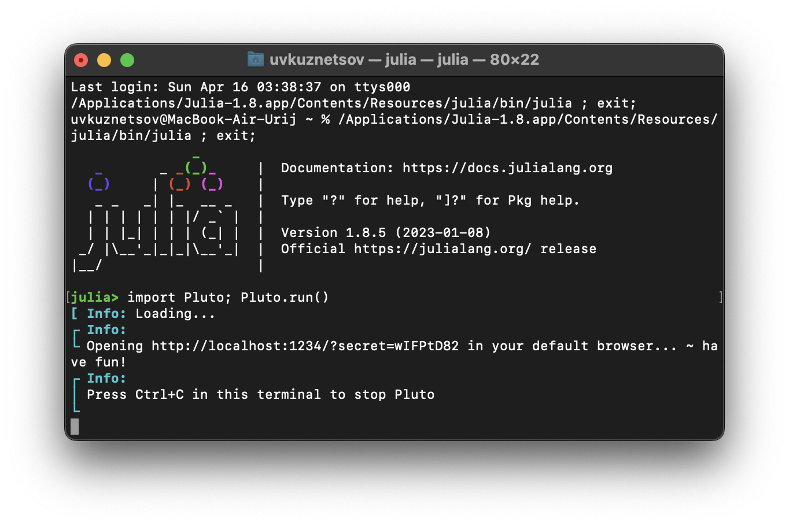
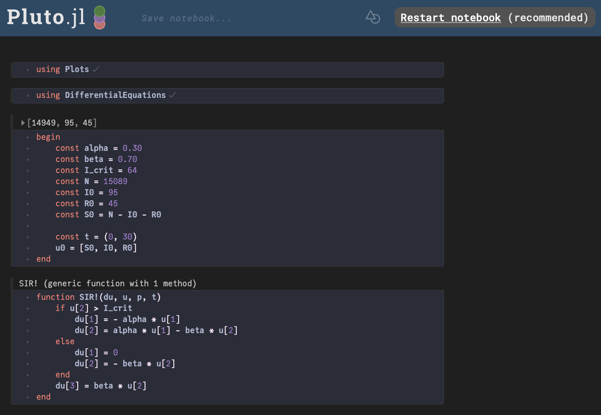
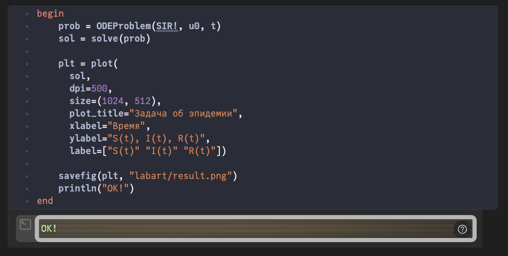
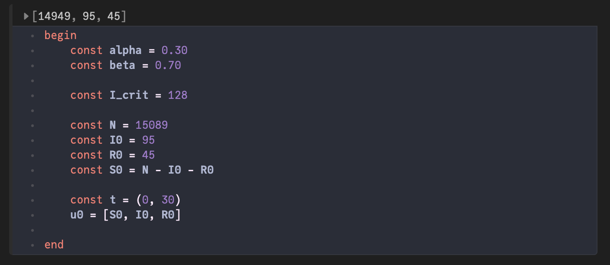
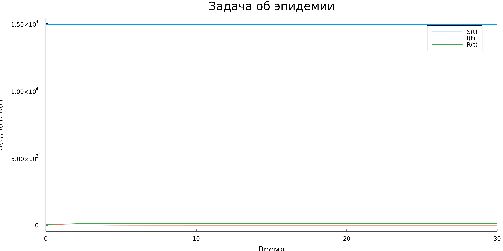
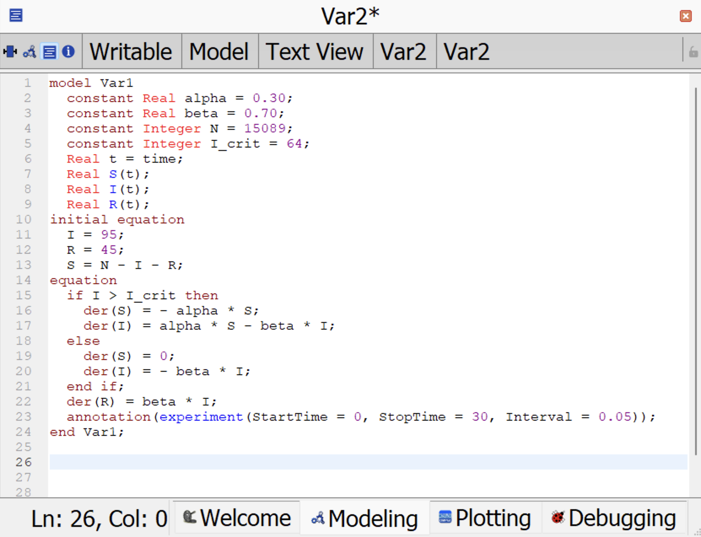
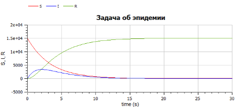
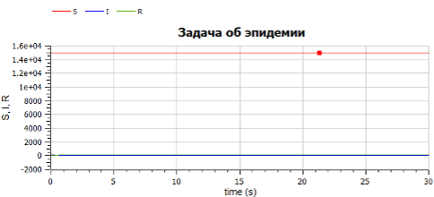

---
## Front matter
title: "Лабораторная работа №6"
subtitle: "Задача об эпидемии"
author: "Кузнецов Юрий Владимирович"

## Generic otions
lang: ru-RU
toc-title: "Содержание"

## Bibliography
bibliography: bib/cite.bib
csl: pandoc/csl/gost-r-7-0-5-2008-numeric.csl

## Pdf output format
toc: true # Table of contents
toc-depth: 2
lof: true # List of figures
lot: false # List of tables
fontsize: 12pt
linestretch: 1.5
papersize: a4
documentclass: scrreprt
## I18n polyglossia
polyglossia-lang:
  name: russian
polyglossia-otherlangs:
  name: english
## I18n babel
babel-lang: russian
babel-otherlangs: english
## Fonts
mainfont: PT Serif
romanfont: PT Serif
sansfont: PT Sans
monofont: PT Mono
mainfontoptions: Ligatures=TeX
romanfontoptions: Ligatures=TeX
sansfontoptions: Ligatures=TeX,Scale=MatchLowercase
monofontoptions: Scale=MatchLowercase,Scale=0.9
## Biblatex
biblatex: true
biblio-style: "gost-numeric"
biblatexoptions:
  - parentracker=true
  - backend=biber
  - hyperref=auto
  - language=auto
  - autolang=other*
  - citestyle=gost-numeric
## Pandoc-crossref LaTeX customization
figureTitle: "Рис."
tableTitle: "Таблица"
listingTitle: "Листинг"
lofTitle: "Список иллюстраций"
lotTitle: "Список таблиц"
lolTitle: "Листинги"
## Misc options
indent: true
header-includes:
  - \usepackage{indentfirst}
  - \usepackage{float} # keep figures where there are in the text
  - \floatplacement{figure}{H} # keep figures where there are in the text
---

# Цель работы

Рассмотреть модель эпидемии. Построить вышеуказанную модель средствами OpenModelica и Julia.

# Задачи

На одном острове вспыхнула эпидемия. Известно, что из всех проживающих на острове ($N=15089$) в момент начала эпидемии ($t=0$) число заболевших людей (являющихся распространителями инфекции) $I(0)=95$, А число здоровых людей с иммунитетом к болезни $R(0)=45$. Таким образом, число людей восприимчивых к болезни, но пока здоровых, в начальный момент времени $S(0)=N-I(0)- R(0)$.

Построить графики изменения числа особей в каждой из трех групп. Рассмотреть, как будет протекать эпидемия в случае:

1. если $I(0) \leq I^*$
2. если $I(0) > I^*$

# Среда

-   Julia – это открытый свободный высокопроизводительный динамический язык высокого уровня, созданный специально для технических (математических) вычислений. Его синтаксис близок к синтаксису других сред технических вычислений, таких как Matlab и Octave. [@unn-julia]

-   OpenModelica — свободное открытое программное обеспечение для моделирования, симуляции, оптимизации и анализа сложных динамических систем. Основано на языке Modelica.

# Теоретическое введение

Предположим, что некая популяция, состоящая из $N$ особей, (считаем, что популяция изолирована) подразделяется на три группы. Первая группа - это восприимчивые к болезни, но пока здоровые особи, обозначим их через $S(t)$. Вторая группа – это число инфицированных особей, которые также при этом являются распространителями инфекции, обозначим их $I(t)$. А третья группа, обозначающаяся через $R(t)$ – это здоровые особи с иммунитетом к болезни.

До того, как число заболевших не превышает критического значения $I^*$, считаем, что все больные изолированы и не заражают здоровых. Когда $I(t) > I^*$, тогда инфицирование способны заражать восприимчивых к болезни особей.

Таким образом, скорость изменения числа $S(t)$ меняется по следующему закону:

$$
\frac{dS}{dt} =
\begin{cases}
-\alpha S,\ если\ I(t) > I^* \\
0,\ если\ I(t) \leq I^* \\
\end{cases}
$$

Поскольку каждая восприимчивая к болезни особь, которая, в конце концов, заболевает, сама становится инфекционной, то скорость изменения числа инфекционных особей представляет разность за единицу времени между заразившимися и теми, кто уже болеет и лечится.

А скорость изменения выздоравливающих особей (при этом приобретающие иммунитет к болезни)

$$
\frac{dR}{dt} = \beta I
$$

Постоянные пропорциональности $\alpha$, $\beta$ - это коэффициенты заболеваемости и выздоровления соответственно.

# Ход работы

Запускаем Pluto.



Подкдлючим пакеты Plots и DifferentialEquations. Далее объявим начальные данные при помощи констант. Также объявим начальное условие для системы ДУ и промежуток времени, на котором будет проходить моделирование. После этого объявим функцию, представляющую систему.

```
using Plots
using DifferentialEquations

const alpha = 0.30
const beta = 0.70
const I_crit = 64
const N = 15089
const I0 = 95
const R0 = 45
const S0 = N - I0 - R0

const t = (0, 30) 
u0 = [S0, I0, R0] 

function SIR!(du, u, p, t)
	if u[2] > I_crit
		du[1] = - alpha * u[1]
		du[2] = alpha * u[1] - beta * u[2]
	else
		du[1] = 0
		du[2] = - beta * u[2]
	end
	du[3] = beta * u[2]
end
```



В следующей ячейке Pluto построим модель. При помощи DifferentialEquations зададим и решим систему ДУ, после чего построим график решения и сохраним его. Далее запустим итоговый скрипт.

```
prob = ODEProblem(SIR!, u0, t)
sol = solve(prob)
	
plt = plot(
    sol,
	dpi=500,
	size=(1024, 512),
	plot_title="Задача об эпидемии",
	xlabel="Время",
	ylabel="S(t), I(t), R(t)",
	label=["S(t)" "I(t)" "R(t)"])
	
	savefig(plt, "labart/result.png")
	println("OK!")
```




Изменим значения $I^*$, так чтобы начальное число заболевших не превышало критическое значение.

```Julia
const alpha = 0.30
const beta = 0.70
const I_crit = 128

const N = 15089
const I0 = 95
const R0 = 45
const S0 = N - I0 - R0

const t = (0, 30)
u0 = [S0, I0, R0]
```





Постройте графики изменения числа особей в каждой из трех групп на Modelica. Для начала рассмотрим случай, когда $I(0) > I^*$. 

```
model Var1
  constant Real alpha = 0.30;
  constant Real beta = 0.70;
  constant Integer N = 15089;
  constant Integer I_crit = 64;
  Real t = time;
  Real S(t);
  Real I(t);
  Real R(t);
initial equation
  I = 95;
  R = 45;
  S = N - I - R;
equation
  if I > I_crit then
    der(S) = - alpha * S;
    der(I) = alpha * S - beta * I;
  else
    der(S) = 0;
    der(I) = - beta * I;
  end if;
  der(R) = beta * I;
  annotation(experiment(StartTime = 0, StopTime = 30, Interval = 0.05));
end Var1;
```





Теперь рассмотрим случай, когда $I(0) \leq I^*$. Для этого изменим значение I критического. 

```
model Var2
  constant Real alpha = 0.30;
  constant Real beta = 0.70;
  constant Integer N = 15089;
  constant Integer I_crit = 128;
  Real t = time;
  Real S(t);
  Real I(t);
  Real R(t);
initial equation
  I = 95;
  R = 45;
  S = N - I - R;
equation
  if I > I_crit then
    der(S) = - alpha * S;
    der(I) = alpha * S - beta * I;
  else
    der(S) = 0;
    der(I) = - beta * I;
  end if;
  der(R) = beta * I;
  annotation(experiment(StartTime = 0, StopTime = 30, Interval = 0.05));
end Var2;

```




# Выводы

Повысили навыки моделирования на Julia, а также навыки моделирования на OpenModelica. Изучили видоизмененную модель заражения SIR и решили при ее помощи задачу об эпидемии, также ещё больше работали с Pluto.

# Ресурсы

* 	Julia [Электронный ресурс]. URL: http://www.unn.ru/books/met_files/JULIA_tutorial.pdf.
* 	OpenModelica [Электронный ресурс]. URL: https://ru.wikipedia.org/wiki/OpenModelica.
* 	Модель хищник-жертва [Электронный ресурс]. RUDN. URL: https://esystem.rudn.ru/mod/resource/view.php?id=967249.
* 	Pluto [Электронный ресурс]. URL: https://plutojl.org/.
* 	Plots in Julia [Электронный ресурс]. URL: https://docs.juliaplots.org/latest/tutorial/.
* 	Differential Equations in Julia [Электронный ресурс]. URL: https://docs.sciml.ai/DiffEqDocs/stable/getting_started/.
