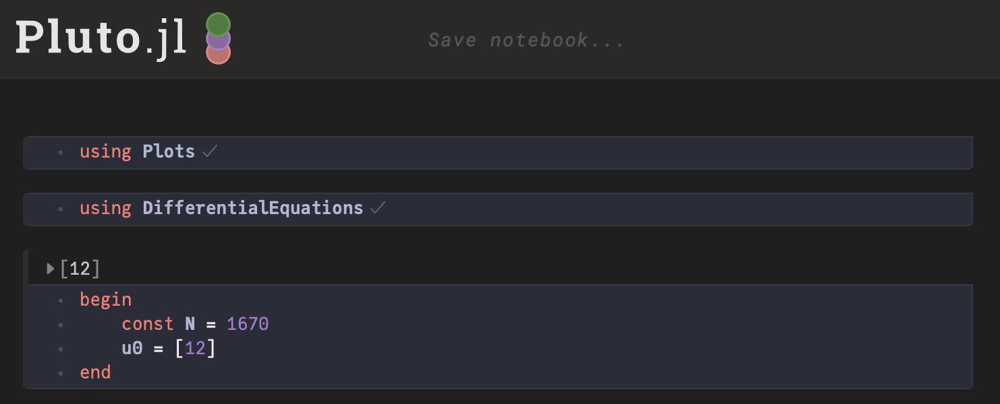
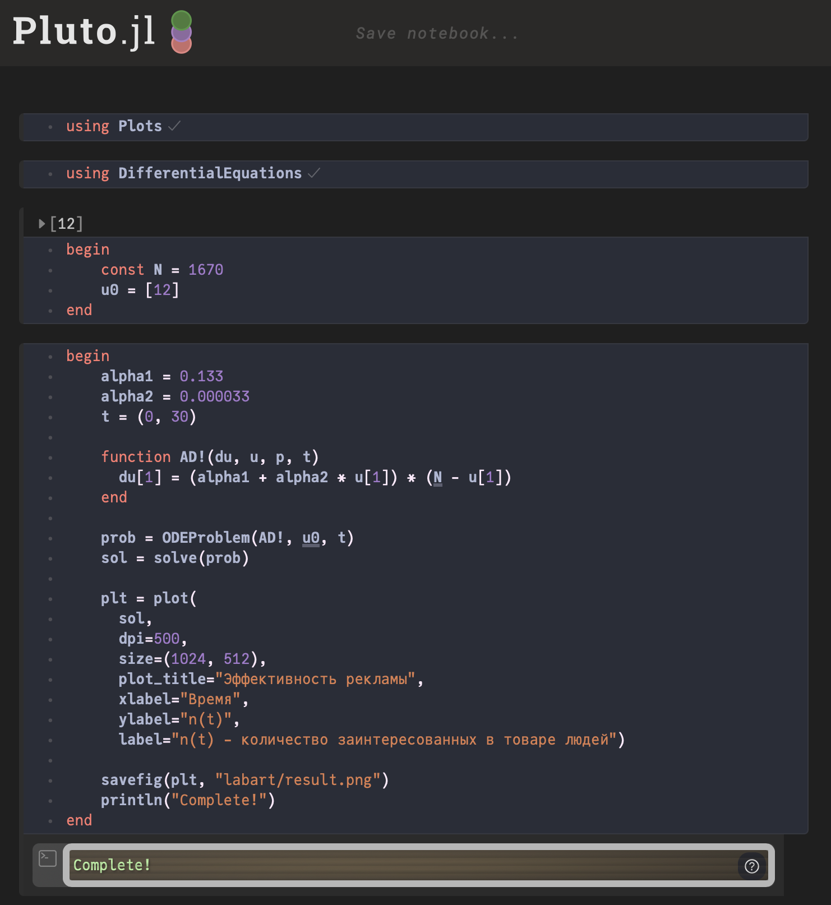
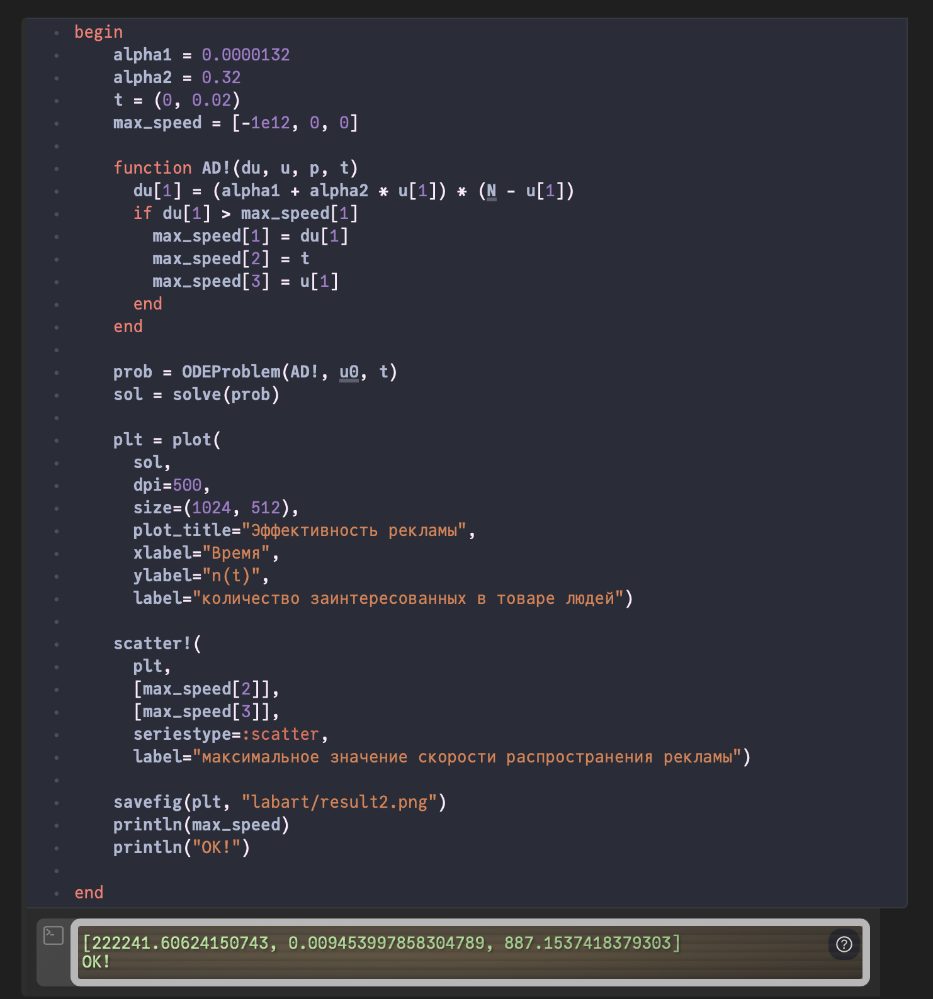
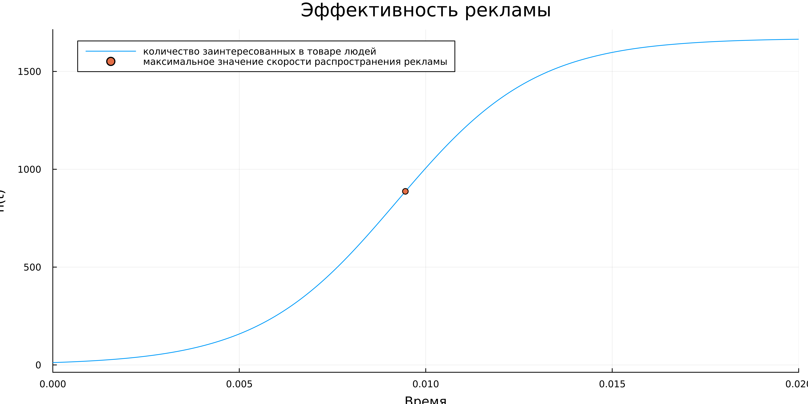
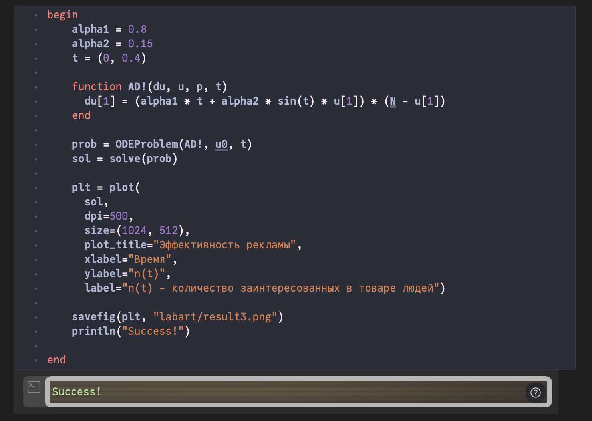
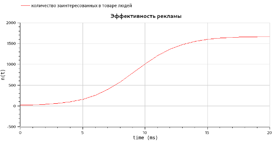

---
## Front matter
title: "Лабораторная работа №7"
subtitle: "Эффективность рекламы"
author: "Кузнецов Юрий Владимирович"

## Generic otions
lang: ru-RU
toc-title: "Содержание"

## Bibliography
bibliography: bib/cite.bib
csl: pandoc/csl/gost-r-7-0-5-2008-numeric.csl

## Pdf output format
toc: true # Table of contents
toc-depth: 2
lof: true # List of figures
lot: false # List of tables
fontsize: 12pt
linestretch: 1.5
papersize: a4
documentclass: scrreprt
## I18n polyglossia
polyglossia-lang:
  name: russian
  options:
	- spelling=modern
	- babelshorthands=true
polyglossia-otherlangs:
  name: english
## I18n babel
babel-lang: russian
babel-otherlangs: english
## Fonts
mainfont: PT Serif
romanfont: PT Serif
sansfont: PT Sans
monofont: PT Mono
mainfontoptions: Ligatures=TeX
romanfontoptions: Ligatures=TeX
sansfontoptions: Ligatures=TeX,Scale=MatchLowercase
monofontoptions: Scale=MatchLowercase,Scale=0.9
## Biblatex
biblatex: true
biblio-style: "gost-numeric"
biblatexoptions:
  - parentracker=true
  - backend=biber
  - hyperref=auto
  - language=auto
  - autolang=other*
  - citestyle=gost-numeric
## Pandoc-crossref LaTeX customization
figureTitle: "Рис."
tableTitle: "Таблица"
listingTitle: "Листинг"
lofTitle: "Список иллюстраций"
lotTitle: "Список таблиц"
lolTitle: "Листинги"
## Misc options
indent: true
header-includes:
  - \usepackage{indentfirst}
  - \usepackage{float} # keep figures where there are in the text
  - \floatplacement{figure}{H} # keep figures where there are in the text
---

# Цель работы

Рассмотреть модель распространениинформации о товаре (модель распространения рекламы). Построить вышеуказанную модель средствами OpenModellica и Julia.

# Задачи

Построить график распространения рекламы, математическая модель которой описывается следующим уравнением

1. $\frac{dn}{dt} = (0.133 + 0.000033n(t))(N - n(t))$
2. $\frac{dn}{dt} = (0.0000132 + 0.32n(t))(N - n(t))$
3. $\frac{dn}{dt} = (0.8t + 0.15\sin(t)n(t))(N - n(t))$

При этом объем аудитории $N = 1670$, в начальный момент о товаре знает 12 человек. Для случая 2 определить в какой момент времени скорость распространения рекламы будет иметь максимальное значение.

# Среда

-   Julia – это открытый свободный высокопроизводительный динамический язык высокого уровня, созданный специально для технических (математических) вычислений. Его синтаксис близок к синтаксису других сред технических вычислений, таких как Matlab и Octave. [@unn-julia]

-   OpenModelica — свободное открытое программное обеспечение для моделирования, симуляции, оптимизации и анализа сложных динамических систем. Основано на языке Modelica. [@wiki-om]

# Теоретическое введение

Предположим, что реализуется некоторая продукция, о которой в момент времени t из числа потенциальных покупателей N знает лишь n покупателей. Для ускорения сбыта продукции запускается реклама через СМИ. После запуска рекламной кампании информация о продукции начнет распространяться путем общения друг с другом. Таким образом, после запуска рекламных объявлений скорость изменения числа знающих о продукции людей пропорциональна как числу знающих о товаре, так и числу покупателей о нем не знающих. 

Модель рекламной кампании описывается следующими величинами. Считаем, что $\frac{dn}{dt}$ - скорость изменения со временем числа потребителей, узнавших о товаре и готовых его купить, t - время, прошедшее с начала рекламной кампании, n(t) - число уже информированных клиентов. Эта величина пропорциональна числу покупателей, еще не знающих о нем, это описывается следующим образом: $\alpha_1(t)(N - n(t))$,где N - общее число потенциальных покупателей, $\alpha_1(t) > 0$ - характеризует интенсивность рекламной кампании (зависит от затрат на рекламу в данный момент времени). Помимо этого, узнавшие о товаре потребители также распространяют полученную информацию среди не знающих о нем. Этот вклад в рекламу описывается величиной $\alpha_2(t)n(t)(N - n(t))$, эта величина увеличивается с увеличением потребителей узнавших о товаре. Математическая модель распространения рекламы описывается уравнением:

$$
\frac{dn}{dt} = (\alpha_1(t) - \alpha_2(t)n(t))(N - n(t))
$$

# Ход работы

Зарускаем Pluto. 


Первым делом подкючим пакеты Plots и DifferentialEquations. Далее объявим начальные данные верные для всех кейсов при помощи констант. Также объявим начальное условие для системы ДУ. (рис. @fig:002)

```
using Plots
using DifferentialEquations

const N = 1670
u0 = [12]
```



Построим модель при помощи DifferentialEquations и решим систему ДУ. Построим график решения и сохраним его. Запустим код.

```
alpha1 = 0.133
	alpha2 = 0.000033
	t = (0, 30)
	
	function AD!(du, u, p, t)
	  du[1] = (alpha1 + alpha2 * u[1]) * (N - u[1])
	end
	
	prob = ODEProblem(AD!, u0, t)
	sol = solve(prob)
	
	plt = plot(
	  sol,
	  dpi=500,
	  size=(1024, 512),
	  plot_title="Эффективность рекламы",
	  xlabel="Время",
	  ylabel="n(t)",
	  label="n(t) - количество заинтересованных в товаре людей")
	
	savefig(plt, "labart/result.png")
	println("Complete!")
```




Изменим значения коэффициентов $\alpha$, так же модернизируем функцию системы, чтобы найти максимальное значение и будем сохранять его в заранне заданную переменную. После чего на графике реения системы отобразим точку, которая соответствует максимальной скорости распространения рекламы.

```
alpha1 = 0.0000132 
alpha2 = 0.32 
t = (0, 0.02) 
max_speed = [-1e12, 0, 0] 

function AD!(du, u, p, t)
    du[1] = (alpha1 + alpha2 * u[1]) * (N - u[1])
    if du[1] > max_speed[1]
    max_speed[1] = du[1]
    max_speed[2] = t
    max_speed[3] = u[1]
    end
end

prob = ODEProblem(AD!, u0, t)
sol = solve(prob)

plt = plot(
    sol,
    dpi=500,
    size=(1024, 512),
    plot_title="Эффективность рекламы",
    xlabel="Время",
    ylabel="n(t)",
    label="количество заинтересованных в товаре людей")

scatter!(
    plt,
    [max_speed[2]],
    [max_speed[3]],
    seriestype=:scatter,
    label="максимальное значение cкорости распространения рекламы")

savefig(plt, "results/result2.png")
println(max_speed)
println("OK!")
```





Изменим скрипт 1го кода, а именно поменяем $\alpha$, промежуток времени, а также изменим функцию в соотвествии с задачей.

```
alpha1 = 0.8
alpha2 = 0.15
t = (0, 0.4)

function AD!(du, u, p, t)
    du[1] = (alpha1 * t + alpha2 * sin(t) * u[1]) * (N - u[1])
end

prob = ODEProblem(AD!, u0, t)
sol = solve(prob)

plt = plot(
    sol,
    dpi=500,
    size=(1024, 512),
    plot_title="Эффективность рекламы",
    xlabel="Время",
    ylabel="n(t)",
    label="n(t) - количество заинтересованных в товаре людей")

savefig(plt, "labart/result3.png")
println("Success!")
```




Напишем код на modelica для решения 1-ой задачи. После чего запустим его и сохраним график.

```
model Var1
  constant Integer N = 1670;
  constant Real alpha1 = 0.133;
  constant Real alpha2 = 0.000033;
  Real t = time;
  Real n(t);
initial equation
    n = 12;
equation
  der(n) = (alpha1 + alpha2 * n) * (N - n);
  annotation(experiment(StartTime = 0, StopTime = 30, Interval = 0.001));
end Var1;
```


Напишем скрипт на modelica для решения 2-ой задачи: изменим начальные значения. После чего запустим его и сохраним график.

```
model Var2
  constant Integer N = 1670;
  constant Real alpha1 = 0.0000132;
  constant Real alpha2 = 0.32;
  Real t = time;
  Real n(t);
initial equation
    n = 12;
equation
  der(n) = (alpha1 + alpha2 * n) * (N - n);
  annotation(experiment(StartTime = 0, StopTime = 0.02, Interval = 0.001));
end Var2;
```




Напишем скрипт на modelica для решения 3-ой задачи: изменим начальные значения, а также уравнение. После чего запустим его и сохраним график.

```
model Var3
  constant Integer N = 1670;
  constant Real alpha1 = 0.8;
  constant Real alpha2 = 0.15;
  Real t = time;
  Real n(t);
initial equation
    n = 12;
equation
  der(n) = (alpha1 * t + alpha2 * sin(t) * n) * (N - n);
  annotation(experiment(StartTime = 0, StopTime = 0.4, Interval = 0.001));
end Var3;
```


# Вывод

 Повысили навыки в решении ДУ, поближе познакомились с моделированием на Julia и OpenModelica. Изучили и построили модель распространения рекламы.

# Ресурсы

* 	Julia. URL: http://www.unn.ru/books/met_files/JULIA_tutorial.pdf.
* 	OpenModelica [Электронный ресурс]. URL: https://ru.wikipedia.org/wiki/OpenModelica.
* 	Эффективность рекламы. RUDN. URL: https://esystem.rudn.ru/mod/resource/view.php?id=967253.
* 	Pluto. URL: https://plutojl.org/.
* 	Plots in Julia. URL: https://docs.juliaplots.org/latest/tutorial/.
* 	Differential Equations in Julia. URL: https://docs.sciml.ai/DiffEqDocs/stable/getting_started/.
